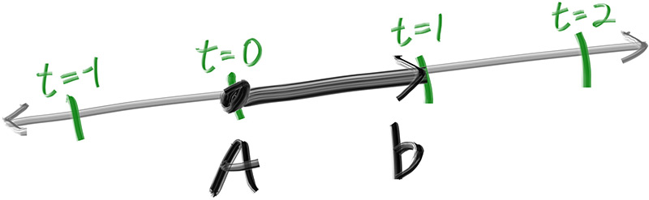

# Rayscape

## Idea

A Ray Tracing implementation in Go based on the amazing book: [_Ray Tracing in One Weekend_](https://raytracing.github.io/books/RayTracingInOneWeekend.html)

## Motivation

The motivation behind this project is to learn more about Go types and references, and have some fun with images.

## Run

To run and generate the image

```bash
go run .
```

## Last Chapter: 9

## My Development Notes

This is a section that I generally use to register my notes, because I need to write to remember things, you don't need to read it.

All the Figures comes from the book ([_Ray Tracing in One Weekend_](https://raytracing.github.io/books/RayTracingInOneWeekend.html)), I am copying them here only for study purposes.

Remember to my future self: Follow this notes along with the book, to see the results of each chapter.

### 1. Overview

Seems pretty fun, I will do it using Go.

### 2. Output an Image

The PPM image format is pretty straightforward, I remember having contact with it in my <i>Digital Image Processing </i> course at college. Here is the [Wikipedia](https://en.wikipedia.org/wiki/Netpbm#PPM_example) example:


### 3. The Vec3 Class

Use a unique Vec3 type to generalize everything that can be modelated using a 3D tuple, such as:

- Points (x, y, z)
- Colors (R, G, B)
- Directions
- Others

I implemented all operations related to vectors as part of the `vector` package, some of them as methods of the type `Vec3` and others as functions.

Nothing much to add for now.

### 4. Rays, a Simple Camera, and Background

#### Ray

In the context of Raytracing, I understand a Ray as being a mathematical construct used to simulate the path of light inside a scene. It represents a line segment that originates from a specific point and travels to a particular direction.

So, we can think of a Ray as the function: $P(t)=A+tb$, where:

- $A$: the starting point of the Ray (Origin). In the context of the project we use as the position of the camera multiple times.
- $b$: the Ray direction, a unit vector that defines the direction in which the ray travels.
- $t$: variable that controls the position along the Ray.

Figure:



#### Camera, Viewport and sending Rays

- **Camera:** The camera defines the viewpoint from which the scene is observed. It determines the position, orientation, and field of view, controlling what part of the scene is visible and how it is projected onto the viewport.

- **Viewport:** The viewport acts as a window through which the scene is viewed. It represents the rectangular area where the final image will be projected based on the camera's perspective. The viewport corresponds to the image plane in the rendering process, where each pixel represents a point in the scene. In this case, the viewport is positioned

- **Rays:** Rays originate from the camera, pass through the viewport, and are used to render the scene. As each ray travels through the scene, it interacts with objects, sampling colors and effects such as shadows, reflections, and refractions. The collected information from these interactions determines the color of the pixels in the final rendered image.

**Ray Color**: An important aspect is to define which type of processing will be made to generate the final color rendered based on the ray hit, for now, we are using the coordinate Y of the image to define a weight and render a gradient between white and blue.

### 5. Adding a Sphere

The first object added to the scene, until now we were rendering only colors.

Here I hard coded an Sphere with center at (0, 0, -1) with radius 0.5, that's in front of the camera but more deep in the scene. And for every ray that hits this Sphere I just render a pixel in the color RED. The result is a RED circle.

That part was fun, I understood (more or less) about the Rays responsibility.

### 6. Surface Normals and Multiple Objects

Surface Normals are vectors that are perpendicular to the surface at the point of intersection, it works like a guide for many things.

Here's an example of a Sphere Normal (Outward), we can calculate it with the difference of the hit point $P$ and the center of the sphere $C$, $P - C$.


The rest of this chapters was modifying the shader (add color) part for the sphere. Instead of only rendering RED for all the points of the Sphere, here we used the normal vectors to generate the colors:

1. Transform the normals components (x, y, z) from [-1, 1] to [0, 1].
2. Map (x, y, z) components to (red, green, blue).

But, we used only the closest hit point, without worry about negative values of `t`.

The result is now, instead a RED circle, a cool gradient circle.

#### Generalization of hittable objects

Along the chapter the writer suggests a generalization of "hittable" objects (Ex: the Sphere is a hittable), because our Sphere was hard-coded. It was fun, we made an interface `Hittable` and made a type `Sphere` that implements it. Looks like that will help a lot to add new forms in the future.

Here we define as well that we are gonna make the normals always points out, and then because of that we need to determine which side the ray is on when we color it. We do it by comparing the ray with the normal.

Another cool thing was the definition of a type that's a list of `Hittable` objects, to facilitate the handling of multiple objects inside a unique data structure.

Some constants were defined, and the main program was refactored, together with adding a new sphere object to represent a "floor" in the image.

An `Interval` type was defined to manage real-valued intervals with a minimum and a maximum, and it was applied in a lot of places.


### 7. Moving Camera Code Into Its Own Class
The chapter title says it all. A lot of refactor.

### 8. Antialiasing
