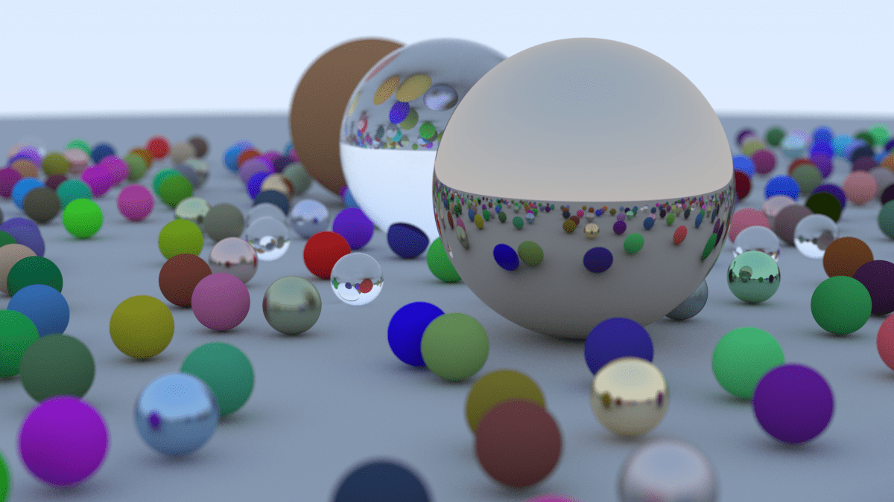

# Rayscape



## Content Table
<!--toc:start-->
- [Rayscape](#rayscape)
  - [Idea](#idea)
  - [Motivation](#motivation)
  - [Run](#run)
  - [Benchmarks](#benchmarks)
  - [My Development Notes](#my-development-notes)
    - [1. Overview](#1-overview)
    - [2. Output an Image](#2-output-an-image)
    - [3. The Vec3 Class](#3-the-vec3-class)
    - [4. Rays, a Simple Camera, and Background](#4-rays-a-simple-camera-and-background)
      - [Ray](#ray)
      - [Camera, Viewport and sending Rays](#camera-viewport-and-sending-rays)
    - [5. Adding a Sphere](#5-adding-a-sphere)
    - [6. Surface Normals and Multiple Objects](#6-surface-normals-and-multiple-objects)
      - [Generalization of hittable objects](#generalization-of-hittable-objects)
    - [7. Moving Camera Code Into Its Own Class](#7-moving-camera-code-into-its-own-class)
    - [8. Antialiasing](#8-antialiasing)
    - [9. Diffuse Materials](#9-diffuse-materials)
      - [9.3 Shadow Acne](#93-shadow-acne)
      - [9.4 True Lambertian Reflection](#94-true-lambertian-reflection)
      - [9.5 Using Gamma Correction for Accurate Color Intensity](#95-using-gamma-correction-for-accurate-color-intensity)
    - [10. Metal](#10-metal)
      - [10.6. Fuzzy Reflection](#106-fuzzy-reflection)
    - [11. Dieletrics](#11-dieletrics)
    - [12. Positionable Camera](#12-positionable-camera)
      - [12.1. Camera Viewing Geometry](#121-camera-viewing-geometry)
      - [12.2. Positioning and Orienting the Camera](#122-positioning-and-orienting-the-camera)
    - [13. Defocus Blur](#13-defocus-blur)
    - [14. Where Next?](#14-where-next)
<!--toc:end-->

## Idea

A Ray Tracing implementation in Go based on the amazing book: [_Ray Tracing in One Weekend_](https://raytracing.github.io/books/RayTracingInOneWeekend.html)

## Motivation

The motivation behind this project is to learn more about Go types and references, and have some fun with Ray Tracing .

## Run

To run and generate the image

```bash
go run .
```

## Benchmarks

Time to render the first time:
- 6904.111147s -> 1 Hour 55 Minutes 4.1111 Seconds

Time to render rendering 10 lines at a time (10 goroutines), and almost killing my CPU: 
- 1068.692736s -> 17 Minutes 48.6927 Seconds
## My Development Notes

This is a section that I generally use to register my notes, because I need to write to remember things, you don't need to read it.

All the Figures comes from the book ([_Ray Tracing in One Weekend_](https://raytracing.github.io/books/RayTracingInOneWeekend.html)), I am copying them here only for study purposes.

Remember to my future self: Follow this notes along with the book, to see the results of each chapter.

### 1. Overview

Seems pretty fun, I will do it using Go.

### 2. Output an Image

The PPM image format is pretty straightforward, I remember having contact with it in my <i>Digital Image Processing </i> course at college. Here is the [Wikipedia](https://en.wikipedia.org/wiki/Netpbm#PPM_example) example:


### 3. The Vec3 Class

Use a unique Vec3 type to generalize everything that can be modelated using a 3D tuple, such as:

- Points (x, y, z)
- Colors (R, G, B)
- Directions
- Others

I implemented all operations related to vectors as part of the `vector` package, some of them as methods of the type `Vec3` and others as functions.

Nothing much to add for now.

### 4. Rays, a Simple Camera, and Background

#### Ray

In the context of Raytracing, I understand a Ray as being a mathematical construct used to simulate the path of light inside a scene. It represents a line segment that originates from a specific point and travels to a particular direction.

So, we can think of a Ray as the function: $P(t)=A+tb$, where:

- $A$: the starting point of the Ray (Origin). In the context of the project we use as the position of the camera multiple times.
- $b$: the Ray direction, a unit vector that defines the direction in which the ray travels.
- $t$: variable that controls the position along the Ray.

Figure:


#### Camera, Viewport and sending Rays

- **Camera:** The camera defines the viewpoint from which the scene is observed. It determines the position, orientation, and field of view, controlling what part of the scene is visible and how it is projected onto the viewport.

- **Viewport:** The viewport acts as a window through which the scene is viewed. It represents the rectangular area where the final image will be projected based on the camera's perspective. The viewport corresponds to the image plane in the rendering process, where each pixel represents a point in the scene. In this case, the viewport is positioned

- **Rays:** Rays originate from the camera, pass through the viewport, and are used to render the scene. As each ray travels through the scene, it interacts with objects, sampling colors and effects such as shadows, reflections, and refractions. The collected information from these interactions determines the color of the pixels in the final rendered image.

**Ray Color**: An important aspect is to define which type of processing will be made to generate the final color rendered based on the ray hit, for now, we are using the coordinate Y of the image to define a weight and render a gradient between white and blue.

### 5. Adding a Sphere

The first object added to the scene, until now we were rendering only colors.

Here I hard coded an Sphere with center at (0, 0, -1) with radius 0.5, that's in front of the camera but more deep in the scene. And for every ray that hits this Sphere I just render a pixel in the color RED. The result is a RED circle.

That part was fun, I understood (more or less) about the Rays responsibility.

### 6. Surface Normals and Multiple Objects

Surface Normals are vectors that are perpendicular to the surface at the point of intersection, it works like a guide for many things.

Here's an example of a Sphere Normal (Outward), we can calculate it with the difference of the hit point $P$ and the center of the sphere $C$, $P - C$.


The rest of this chapters was modifying the shader (add color) part for the sphere. Instead of only rendering RED for all the points of the Sphere, here we used the normal vectors to generate the colors:

1. Transform the normals components (x, y, z) from [-1, 1] to [0, 1].
2. Map (x, y, z) components to (red, green, blue).

But, we used only the closest hit point, without worry about negative values of `t`.

The result is now, instead a RED circle, a cool gradient circle.

#### Generalization of hittable objects

Along the chapter the writer suggests a generalization of "hittable" objects (Ex: the Sphere is a hittable), because our Sphere was hard-coded. It was fun, we made an interface `Hittable` and made a type `Sphere` that implements it. Looks like that will help a lot to add new forms in the future.

Here we define as well that we are gonna make the normals always points out, and then because of that we need to determine which side the ray is on when we color it. We do it by comparing the ray with the normal.

Another cool thing was the definition of a type that's a list of `Hittable` objects, to facilitate the handling of multiple objects inside a unique data structure.

Some constants were defined, and the main program was refactored, together with adding a new sphere object to represent a "floor" in the image.

An `Interval` type was defined to manage real-valued intervals with a minimum and a maximum, and it was applied in a lot of places.

### 7. Moving Camera Code Into Its Own Class

The chapter title says it all. A lot of refactor.

### 8. Antialiasing

If you play games you know what it its.

Our images are right now (specially in the Sphere) with some "stair steps" at the borders of it, the so called "aliasing".

Until now, we are using a single ray through the center of each pixel (point sampling), and the problem with that is our ray hits might not represent the plurality of the image,
the book gives us a good example of it: "The problem with point sampling can be illustrated by rendering a small checkerboard far away. If this checkerboard consists of an 8×8 grid of black and white tiles, but only four rays hit it, then all four rays might intersect only white tiles, or only black, or some odd combination. In the real world, when we perceive a checkerboard far away with our eyes, we perceive it as a gray color, instead of sharp points of black and white. That's because our eyes are naturally doing what we want our ray tracer to do: integrate the (continuous function of) light falling on a particular (discrete) region of our rendered image."

So, to solve that our color will be generated based on the pixel itself and on the light falling _around_ the pixel. We then implement the simplest model for that:
sampling the square region centered at the pixel that extends halfway to each of the four neighboring pixels.

To achieve that, we select samples from the area surrounding the pixel and average the resulting light (color) values together:

- Define a number of random ray samples to use: $n$
- For each ray sent, add the color in an accumulative color variable: $acc_color$
- Get the average color: $acc_color/n$
- Ensure that the color components (r, g, b) are in the bounds [0, 1]

### 9. Diffuse Materials

The called _matte_ materials:

- They don't emit their own light
- Light reflects in them with its direction randomized
- They might also absorb the light (the darker the surface, the more likely the ray is absorbed)

We first implement the easiest way of doing diffuse method, that is surfaces that randomly bounces a ray equally in all directions.
To do that we create some functions to _Vec3_ type to generate random vectors.
After that we create a _rejection method_, were we create a lot of random ray samples until we produce a sample that meets a desired criteria:

1. Starting on the Ray hit point $P$, generate a random vector inside of a unit sphere (sphere with radius 1 and center in the point $P$)
2. Normalize this vector
3. Check if the vector falls on the correct hemisphere of the unit sphere (by comparing it with the surface normal)
4. Invert the normalized vector if it falls onto the wrong hemisphere

A good point to remember is that, those rays would bounce until it fails to hit anything.
In simple scenes that is ok, but for complex ones, it's not. So we define a maximum depth for ray bounces.

#### 9.3 Shadow Acne

When a ray hits a surface, it calculates the intersection point with the surface.
This calculation is susceptible to floating point rounding errors, which can cause the intersection point, for example, be bellow the surface
causing the bounce ray to intersect with the surface again, causing _Shadow Acne_.
To solve that, we just ignore hits that are very close to the calculated intersection point, setting our lower bound for the $t$ interval as $0.001$.

#### 9.4 True Lambertian Reflection

A better way to produce diffuse models. Instead of scattering reflected rays evenly.

The definition presented by the book for Lambertian Distribution: "This distribution scatters reflected rays in a manner that is proportional to $cos(ϕ)$, where $ϕ$ is the angle between the reflected ray and the surface normal. This means that a reflected ray is most likely to scatter in a direction near the surface normal, and less likely to scatter in directions away from the normal. This non-uniform Lambertian distribution does a better job of modeling material reflection in the real world than our previous uniform scattering."

To do that, we just add a random unit vector to the normal vector. Simple!
More in depth explanation about the geometry is in the book.

After the changes we get a similar result, but with better shadows and the sky color is having more influence in the object colors.

#### 9.5 Using Gamma Correction for Accurate Color Intensity

Some cool things about reflectance and transformations applied by the computer before showing the image.

Based on that we will store our images in the "gamma space" so we can accurately display the images in the way we want.

To to that, we create a function to transform our image from linear space to gamma space (basically gets the color linear component square root).

The effect of that is that we get a much more consistent ramp from darkness to lightness when adjusting reflectance.

### 10. Metal

The first step is to generalize materials, now that we gonna have 2 types (Matte and Metal), so I built an interface _Material_ that has a method called _Scatter_. The method _Scatter_ defines how a Ray interacts with the material surface.

**HitRecords**:

- Register of hits, stores point of hit P, normal vector on hit surface, material type and everything we want.
- The type definition had to be transfered from `hittable/hittable.go` to `material/material.go`, to avoid circular imports.

Based on the new _Material_ interface, we defined 2 types of material and the:

- _Lambertian:_ represents diffuse objects
  - _Scatter:_ It calculates a new direction for the scattered ray by adding randomness to the surface normal at the hit point. If the calculated direction is nearly zero, it defaults to the normal to ensure proper scattering. The method also sets the color attenuation to the material's albedo, indicating how much light is absorbed versus reflected
- _Metal:_ represents metalic objects
  - _Scatter:_ It calculates the reflection of the incoming ray off the surface based on the surface normal at the hit point. The method then creates a new scattered ray in the reflected direction, originating from the hit point. The color attenuation is set to the material's albedo, indicating how much light is absorbed versus reflected.

At this point we can create a new scene with 2 metal spheres and one diffuse.

#### 10.6. Fuzzy Reflection

The reflection direction of the ray can be randomized by using a small sphere centered at the original endpoint. A new endpoint for the ray is chosen within this sphere's surface, scaled by a fuzz factor.

So the bigger our fuzzy sphere is, the fuzzier the reflections will be. So, our "fuzziness parameter" will be the fuzzy sphere radius.

The idea behind using it so the metals does not look like literal mirrors (reflection angle equals the incident angle).

That looks pretty cool. I will put the explanation image of the book below.


### 11. Dieletrics

Dieletrics are materials that are transparent, and they are used to model things like glass, water, and ice.

When a ray hits a dieletric, it splits into a reflected ray and a refracted (transmitted) ray.

First the book handles it by randomly choosing between reflection and refraction.

The book gives a quick review of terms:

- A **reflect** ray hits a surface at an angle $\theta$ and is reflected at an angle $\phi$ (the angle between the incident ray and the surface normal)
- A **refracted** ray bends as it transitions from one medium to another, and is refracted at an angle $\theta$ and is refracted at an angle $\phi$ (the angle between the incident ray and the surface normal). This is why a pencil looks bent when partially under water.
  - The amount a ray is refracted depends on the refractive indices of the two media (materials). This is basically a single value that describes how much light bends when entering a material from vacuum.
  - When a transparent material is embedded in a different transparent material, you can describe the refraction with a relative index of refraction dividing the refractive index of the object's material divided by the refractive index of the surrounding material. For example, to render a glass ball under water, divide the refractive index of the ball by the refractive index of the water.

The refraction is defined by Snell's Law:

$$n_1 \sin(\theta_1) = n_2 \sin(\theta_2)$$

Where $n_1$ and $n_2$ are the refractive indices of the two media, and $\theta_1$ and $\theta_2$ are the angles of incidence and refraction, respectively. 

Then some math is made in the book, and it shows the end equation using rays, and using that we write the refraction function for the *Vec3* type, and changed our reflection function.

After that we created the *Dieletric* type with total refraction.

The book states that one troublesome practical issue is that there are ray angles for which no solutions exists using Snell's Law. And in those cases the material should reflect instead of refracting.

Then some text about Shilick Approximation.

### 12. Positionable Camera

Time to personalize our camera.

#### 12.1. Camera Viewing Geometry
Vertical Field of View (Vertical FOV or VFOV) refers to the angle of the visible area in a vertical direction through a camera lens or in a computer graphics perspective. It determines how much of the scene is visible vertically.

- Set adjustable field of view (vfov) -> $\theta$
- Viewport height -> $h = tan(\frac{\theta}{2})$

#### 12.2. Positioning and Orienting the Camera

First some nomenclatures (review the book for more details and images):
- The position where we place the camera: *lookfrom*
- The position where we want to look at: *lookat*
- The sideways tilt of the camera (as if you look to some place, and tilt your head around your nose): *vup*
- The camera frame basis vectors: $u$, $v$, $w$

### 13. Defocus Blur

The defocus blur is a type of blur that occurs when the camera is focused on a specific point in space (depth of field).

Focus distance is the distance from the camera to the point of focus. Objects placed at that distance will appear sharper and will linearly appear blurrier the further they are from that distance.

Holy, there is a lot of theory details about cameras in this chapter, cool.


### 14. Where Next?

Mounting the final scene.

The book is amazing, there is 2 more books to go from here, probably I will follow them in the future.

